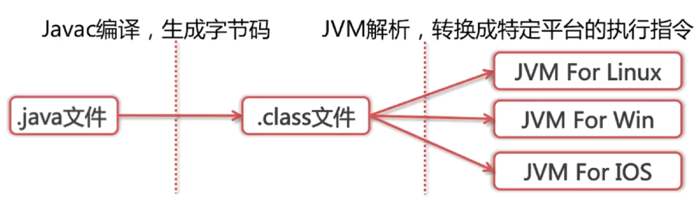
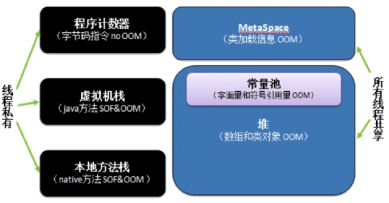
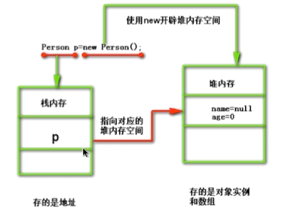

<h1>java特性</h1>
* 平台无关：一次编译，到处运行。
* GC:自动回收垃圾.
* 异常处理
* 语言特性：反射，泛型，面向对象。
For full documentation visit [mkdocs.org](https://mkdocs.org).

## 平台无关如何实现。
原理: JAVA源码首先会被编译成字节码，再有不同平台的JVM进行解析将字节码转换为相应平台的机器指令。

#如何查看字节码（javap 命令反编译）
javap -c myJava   该指令可把java字节码文件反编译汇编。
##为什么不把源码直接编译成机器码。
*省去准备工作：因为编译成机器码，每次执行时都要进行语法，语义的检查，这些工作不会被保留下来，因此引入中间字节码，省去这些检查工作。<p>
*兼容性，也可以将别的语言解析成字节码如Scala，Groovy，Xtend等。<p>
#JVM的架构
JVM架构大致分为4部分：<p>
*`ClassLoader`:依据特定格式加载class文件到内存。<p>
*`Excution Engine`:对命令进行解析。<p>
*`Native Interface`：融合不同的开发语言的原生库为java所用。<p>
*`java运行时数据区域`：JVM的内存空间结构模型。<p>

##什么是反射
Java反射说的是在运行状态中，对于任何一个类，我们都能够知道这个类有哪些方法和属性。对于任何一个对象，我们都能够对它的方法和属性进行调用。我们把这种动态获取对象信息和调用对象方法的功能称之为反射机制。
###反射的三种方式
*通过对象调用 getClass()
```
Person p1 = new Person();
Class c1 = p1.getClass();
```
*直接通过 类名.class 的方式得到,该方法最为安全可靠，程序性能更高
这说明任何一个类都有一个隐含的静态成员变量 class
```
Class c1 = Person.class;
```
*通过 Class 对象的 forName() 静态方法来获取，用的最多，
  但可能抛出 ClassNotFoundException 异常
```
Class c3 = Class.forName("com.reflex.Person");
```
写一个反射的例子
```
//1、获取Class对象
Class<?> c = Class.forName("com.reflex.Person");      
//2、使用Class对象创建该类对象：
Object obj = c.newInstance();
```
#classLoder
类从编译到执行的过程：<p>
*1. 编译器将Person.java文件编译成字节码Person.class。<p>
*2. ClassLoader 将字节码文件转换成JVM中的Class<Person>对象。<p>
*3. JVM利用Class<Person>对象实例化Person对象。<p>

类加载器，具体作用就是将.class文件加载到JVM虚拟机中去，程序就可以正确运行了.第一个阶段。

##什么时候开始需要类加载
*1.实例通过使用new()关键字创建或者使用class.forName反射，但它有可能导致反射，但它有可能导致ClassNotFoundException。<p>
*2.类的静态方法被调用<p>
*3.类的静态域被赋值<p>
*4.静态域被访问，而且它不是常量<p>

##ClassLoader的三种类型。
*`BootStrapClassLoader`:C++编写，加载核心库java.;<p>
*`ExtClassLoader`:java编写，加载扩展库javax.*;<p>
*`AppClassLoader`:java编写，加载程序所在目录;<p>
#编写一个classLoader
(1)继承ClassLoader类。(2)重写fiandClass()方法。(3)调用defineClass()方法，defineClass方法将字节码转化为类。
```
protected synchronized Class<?> loadClass(String name, boolean resolve)
    throws ClassNotFoundException
    {
    // First, check if the class has already been loaded
    Class c = findLoadedClass(name);
    //没有被加载
    if (c == null) {
        try {
        //去父类加载器加载
        if (parent != null) {
            c = parent.loadClass(name, false);
        } else { //如果父类为是null即(Bootstrap ClassLoader)
            c = findBootstrapClass0(name);
        }
        //都没找到,findClass()用户自定义实现,默认没有实现
        } catch (ClassNotFoundException e) {
            // If still not found, then invoke findClass in order
            // to find the class.
            c = findClass(name);
        }
    }
    if (resolve) {
        resolveClass(c);
    }
    return c;
    }
```
##双亲委派机制是什么，作用
当JVM要加载Person.class时<p>
(1)首先会去自定义类加载中查找看是否加载过，如果已经加载过，则返回字节码。<p>
(2)如果没有，则去它的父类加载器AppClassLoader查看是否加载。以此类推。<p>
(3)如果顶层加载器BootStrapClassLoader也未加载过，则开始加载，没找到则到它的子类加载器加载。<p>
(4)最后在自定义类加载器中都未加载，那么就抛出ClassNotFoundException()<p>

###作用
jvm如何认定两个对象同属于一个类型，必须同时满足下面两个条件：
*都是用同名的类完成实例化的。<p>
*两个实例各自对应的同名的类的加载器必须是同一个。比如两个相同名字的类，一个是用系统加载器加载的，一个扩展类加载器加载的，两个类生成的对象将被jvm认定为不同类型的对象。<p>

1.防止内存中出现多份同样的字节码 <p>
2.为了系统类的安全，类似“ java.lang.Object”这种核心类，jvm需要保证他们生成的对象都会被认定为同一种类型。即“通过代理模式，对于 Java 核心库的类的加载工作由引导类加载器来统一完成，保证了 Java 应用所使用的都是同一个版本的 Java 核心库的类，是互相兼容的。
如果自己写一个java.lang.Object，因为双亲委派机制，JVM只会加载系统的java.lang.Object而不会加载自己定义的。

###破坏双亲委托机制
*`第一次`：重写loadClass(),破坏双亲委托
*`第二次`：加载JDBC驱动器时
根据类加载机制，若A类调用B类，则B类由A类的加载器加载
DBC之所以要破坏双亲委派模式是因为，JDBC的核心在rt.jar中由启动类加载器加载，而其实现则在各厂商实现的的jar包中，根据类加载机制，若A类调用B类，则B类由A类的加载器加载，也就是说启动类加载器要加载jar包下的类，我们都知道这是不可能的，启动类加载器负责加载<font color="red">$JAVA_HOME中jre/lib/rt.jar</font>里所有的class，那么JDBC是如何加载这些Driver实现类的？
通过<font color="red">Thread.currentThread().getContextClassLoader()</font>>得到线程上下文加载器来加载Driver实现类。

###loadClass()和Class.forName()的区别
类的加载过程：
！[类加载过程](image/jvm/类加载过程.png)
#java的内存模型
JDK8的内存模型:<p>
	
*`线程私有`：程序计数器，虚拟机栈，本地方法栈<p>
*`线程共享`：(MetaSpace)元空间,Java堆<p>
JDK8对JVM架构的改造将类元数据放到本地内存中，另外，将常量池和静态变量放到Java堆里.元空间的本质和永久代类似，都是对JVM规范中方法区的实现。不过元空间与永久代之间的最大区别在于：元空间并不在虚拟机中，而是使用本地内存。

##线程独占部分
<font color="red">PC计数器</font> ：改变计数器的值选取下一条需要执行的字节码方法。和线程1对1<p>
<font color="red">java虚拟机栈</font>：java方法执行的内存模型;包含多个栈帧。执行一个方法产生一个栈帧。


##线程共享部分
###元空间(metaSpace)和永久代(permGen):元空间使用的是本地内存，永久代使用的JVM内存。<p>
元空间(metaSpace)和permGen的优势。
*字符串常量池存储在永久代中，容易出现性能问题和内存溢出。<p>
*类和方法信息大小难于确定，给永久代的大小指定带来困难。<p>
*永久代会为GC带来不必要的复杂性。<p>
<font color="red">java堆</font>
对象实例的分配区域。
GC管理的主要区域
##java内存模型常考题
###JVM三大性能调优参数-Xms  -Xmx  -Xss
-XSS:规定线程每个虚拟机栈的大小。<p>
-Xms:堆大小的初始值。 
<p>
-Xmx:堆能达到最大值。 如果堆大小不够时，堆会自动扩容为Xmx设置的值。一般将Xmx和Xms一样大。堆太小会发生内存抖动(不断new对象时，内存频繁地分配和回收，而频繁的gc会导致卡顿)
##堆和栈的区别
###内存非配策略
*`静态存储`：编译时确定每个数据目标在运行时的存储空间需求。(编译即确定)<p>
*`栈式存储`:数据区需求在编译时未知，运行时模块入口前确定。<p>
*`堆式存储`:编译时和运行时模块入口都无法确定，动态分配。	<p>
###堆和栈的联系。
联系：引用对象，数组时，栈里定义变量保存堆中目标的首地址。

###区别

*`管理方式`:栈不需要GC，堆需要GC。<p>
*`空间大小`:栈比堆小。<p>
*`碎片相关`:栈产生的碎片远小于堆。<p>
*`分配方式`:栈支持静态和动态分配，堆只支持动态分配。<p>
*`效率`:栈的效率比堆高。<p>

##不同JDK版本下String的intern方法区别(JDK6和JDK6+)


