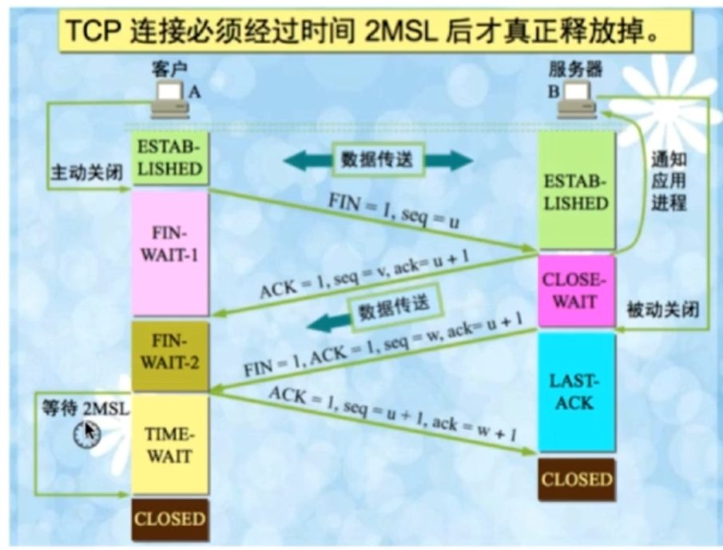
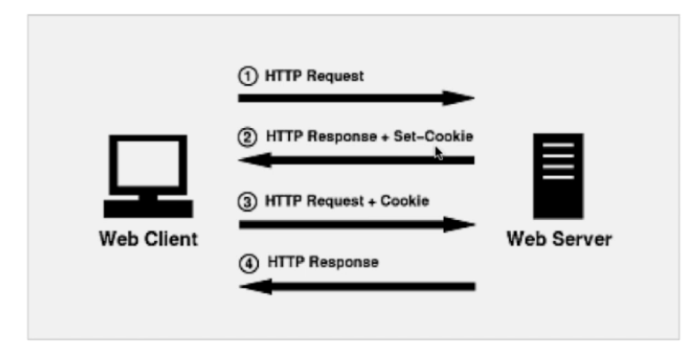
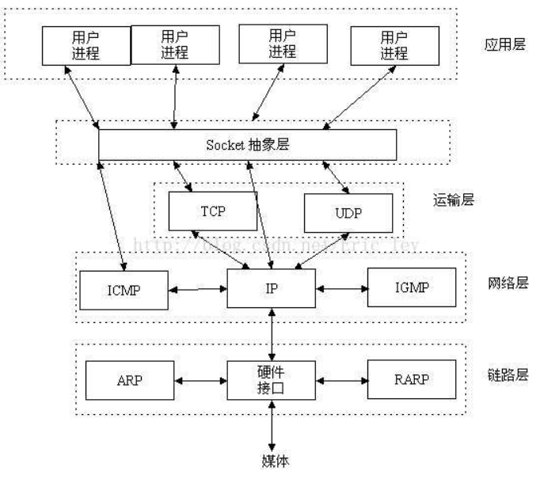

<h1>TCP三次握手</h1>
 当应用程序希望与另一应用程序建立通信时，会进行TCP三次握手。完成三次握手后，TCP将在两个应用程序建立一个全双工通信。

 *`第一次握手`-客户端给服务端发送一个SYN报文，并指明客户端的初始化序列号（syn=x）,此时客户端处于SYN_Send状态。

 *`第二次握手`-服务端在接收到客户端发送的SYN报文后对其进行确认（ack=x+1），同时以自己的SYN报文作为应答，并且也指定自己的初始化序列号（syn=y）,此时服务器处于SYN_REVD状态。

 *`第三次握手`-客户端在接收到SYN报文后,向服务器发送确认包ACK(ack=y+1)，此时客户端处于establised 状态。服务器收到 ACK报文之后，也处于establised 状态，此时，双方以建立起了链接。

 三次握手过程如下：
 		
`SYN`表示请求建立连接,`ACK`表示确认序号，`seq`为标志数据包序号，`ack`确认序号（期望收到下一个数据包的序号）。

##为什么建立三次握手
* 确认客户端服务端发送和接收能力是否正常。
* 指定客户端和服务端的初始化序列号，为后面可靠传输做准备。
* 采用三次握手是为了防止失效的连接请求报文段突然又传送到主机 B ，因而产生错
误。

####采用两次握手出现的问题
有这样一种情况，当A发送一个消息给B，但是由于网络原因，消息被阻塞在了某个节点，然后阻塞的时间超出设定的时间，A会认为这个消息丢失了，然后重新发送消息。当A和B通信完成后，这个被A认为失效的消息，到达了B。对于B而言，以为这是一个新的请求链接消息，就向A发送确认， 对于A而言，它认为没有给B再次发送消息（因为上次的通话已经结束）所有A不会理睬B的这个确认，但是B则会一直等待A的消息。

这就导致了B的时间被浪费（对于服务器而言，CPU等资源是一种浪费），这样是不可行的，这就是为什么不能两次握手的原因了。
第三次握手看似多余其实不然，这主要是为了防止已失效的请求报文段突然又传送到了服务端而产生连接的误判。
<h1>TCP 4次挥手</h1>
*`第一次握手`：客户端发送FIN包，FIN=1,序列号seq=u,关闭客户端到服务端的数据传送，客户端处于FIN_WAITE1状态。

*`第二次握手`：服务器端接收到FIN包，发送一个ACK包，ACK=1,ack=u+1,seq=v,serve进入CLOSE_WAITE状态，此时服务器可以继续发送其他数据包。客户端收到ACK包后进入FIN_WAITE2状态.

*`第三次握手`：服务器端发送FIN包，用来关闭服务器到客户端的数据发送，seq=w,ack=u+1,serve进入LAST_ACK状态。

*`第四次握手`：客户端收到FIN包，客户端进入TIME_WAIT状态，接着发送一个ACK包，ack=w+1，seq=u+1,serve进入CLOSED状态,完成第四次握手。

4次挥手图片如下：
		

<!-- 
For full documentation visit 
[mkdocs.org](https://mkdocs.org). -->

##UDP

* 面向非连接，不维护连接状态。
* 尽最大努力交付。
* 支持广播，即同时向多个客户端传输相同信息。
* 数据包只有8个字节（TCP20个字节），开销小。

## UDP和TCP区别
* TCP面向连接需要维持连接状态，UDP是无连接的。
* TCP保证可靠性,速度相对慢；UDP尽最大努力交付，不保证可靠性。
* TCP利用序列号保证数据包的顺序交付，UDP是无序的。
* TCP占20个字节，相对较大，UDP8个字节相对较小。
#在浏览器中键入URL后经历的过程
* 1.DNS解析，将URL转换为对应的IP（浏览器会现在本地缓存找到URL对应的IP,没有，依次到操作系统DNS缓存->操作系统的host文件->操作系统将域名发送到本地域名服务器）。
* 2.TCP连接，找到对应的IP地址后，客户端会与服务器建立连接。
* 3.发送HTTP请求，建立TCP连接成功后，浏览器会发送Http请求给服务器。
* 4.服务器处理Http请求，并返回HTTP报文。
* 5.断开TCP连接,浏览器解析渲染页面。
##http浏览器缓存机制
待补充
#http和https的区别
待补充
##get请求和POST的区别
*`http层面`-GET请求将数据放在了URLh后面，POST放在Request body里面。

*`数据库层面`-GET请求符合幂等性（同一个url和同样的get参数，呈现给用户都是同样的结果）和安全性（get不会引起数据的变化，例如说对数据库的增删改），POST不符合。

*`其他方面`-GET请求可以被主动缓存，还有长度限制，而PSOT不行（被动缓存）。

*`细节`-GET产生一个TCP数据包（对于GET方式的请求，浏览器会把http header和data一并发送出去，服务器响应200（返回数据））;
POST产生两个TCP数据包（对于POST，浏览器先发送header，服务器响应100 continue，浏览器再发送data，服务器响应200 ok（返回数据））。

##session和cookies的区别
<h3 style="color:blue">cookies</h3> 
*是由服务器发给客户端的特殊信息 。

* 客户端再次请求时，会把cookies回发。

* 服务器接收到后，会解析cookie生成与客户端对应的内容。

Cooike的设置及发送过程如图：

<h3 style="color:blue">session</h3> 
* 服务器端的机制，在服务器上保存信息。

* 解析客户端请求并操作session id,按需保存状态信息。

<h3 style="color:blue">区别</h3> 
* cookies存放在浏览器上，session数据放在服务器上，cooKie不占服务器资源。

* Session相对于Cookie更安全。

（1）cookie不是很安全，别人可以分析存放在本地的cookie并进行cookie欺骗，考虑到安全应当使用session。

（2）session会在一定时间内保存在服务器上。当访问增多，会比较占用你服务器的性能，考虑到减轻服务器性能方面，应当使用cookie。

##stocket通信
socket是在应用层和传输层之间的一个抽象层，它把TCP/IP层复杂的操作抽象为几个简单的接口供应用层调用已实现进程在网络中通信。

通信图：	
