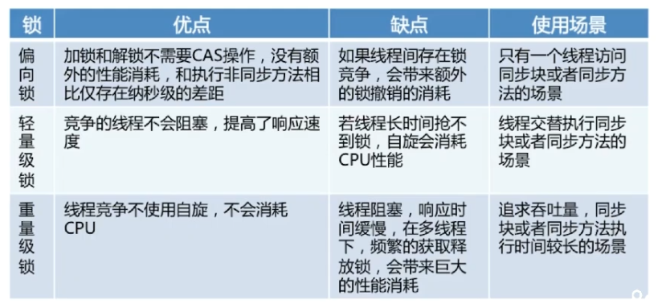

<h1>Synchronized</h1>
锁分类：对象锁和类锁。
##获取对象锁的两种方式
1同步代码块
```
synchronized(this){
    //相应代码块
    //锁是小括号中的实例对象
}
```
2同步非静态方法（synchronized method),锁是当前对象的实例对象。
##获取类锁
1同步代码块
```
synchronized(类.class){}
```
2同步静态方法（synchronized static method）
##对象锁和类锁：
*当一个线程获取对象锁后，另一个线程可以访问该对象的非同步方法。<p>
*同一个类各个对象的对象锁互不干扰，类锁和对象锁互不干扰。
##synchronized 底层实现
###基础
对象头  Monitor<p>
####对象在内存中的布局
对象头 实例数据 对齐填充<p>
对象头由<font color="red"> Mark Word</font>和<font color="red"> Class Metadata Address</font>

Mark word结构：

####Monitor
Monitor:每个java对象天生自带的一把看不见的锁。
```
ObjectMonitor() {
    _header       = NULL;//markOop对象头
    _count        = 0;   //得到锁计数+1，重入一次再加1
    _waiters      = 0,//等待线程数
    _recursions   = 0;//重入次数
    //监视器锁寄生的对象。锁不是平白出现的，而是寄托存储于对象中
    _object       = NULL;    
    _owner        = NULL;//指向获得ObjectMonitor对象的线程或基础锁
    _WaitSet      = NULL;//处于wait状态的线程，会被加入到wait set；
    _WaitSetLock  = 0 ;
    _Responsible  = NULL ;
    _succ         = NULL ;
    _cxq          = NULL ;
    FreeNext      = NULL ;
    _EntryList    = NULL ;//处于等待锁的线程，会被加入到entry set；
    _SpinFreq     = 0 ;
    _SpinClock    = 0 ;
    OwnerIsThread = 0 ;// _owner is (Thread *) vs SP/BasicLock
   _previous_owner_tid = 0; // 监视器前一个拥有者线程的ID  }

```

###JDK6之前synchronized
*属于重量级锁，依赖于Mutex Lock实现。
*线程之间切换需要从用户态转到核心态，开销大。
###JAVA6之后，Synchronized的改进。
待补充
##自旋锁
通过线程执行忙循环等待锁的释放，不让出CPU。共享数据的锁定状态持续时间较短，切换线程不值得，避免线程之间的开销。<p>
缺点：若锁被其他线程长时间占用，会带来许多性能上的开销。（改进：通过-XX:PreBlockSpin设定自旋次数 ，如果超过该值，释放CPU)。
##自适应自旋锁
*自旋的次数不再固定。
*由前一次在同一个锁上的自旋时间及锁的拥有者的状态来决定。
##锁消除

##锁粗化

##synchronized的四种状态
无锁，偏向锁，轻量级锁，重量级锁。  
锁的升级方向：无锁——>偏向锁——>轻量级锁——>重量级锁。
<font color="red">偏向锁：</font>减少同一线程获取锁的代价<p>
    大多数情况下，所不存在多线程竞争，总是由同一个线程多次获得。
    核心思想：如果一个线程获得了锁，就进入偏向锁模式，此时MarkWord 的结构也变成了偏向锁，当线程再次请求锁时，无需再做任何同步操作，即获取锁的过程只需要检查Mark word的锁标记为偏向锁以及当前线程ID等于MarkWord的ThreadID即可。这样就省去了大量有关锁申请的操作。不适用于锁竞争激烈的多线程场合<p>

<font color="red">轻量级锁</font>：由偏向锁升级来的，偏向锁运行在一个线程进入同步块的情况下，当第二个线程加入锁争用的时候，偏向锁就升级为轻量级锁。
适应场景线程交替执行同步块。若存在同一时间访问同一锁的情况，轻量级锁就会升级为重量级锁。<p>
锁汇中：

##sychronized和ReentrantLock的区别
###ReentrantLock(可重入锁)
*`1`:位于java.util.comcurrent.locks包。 <p>
*`2`:和CountDownLatch，FutureTsak,Semaphore一样基于AQS实现。<p>
*`3`:能够实现比Synchronized更细粒度的控制，控制公平,synchroized非公平。 <p>
*`4`:调用lock()后必须调用unlock()释放锁。<p>
```
   //设置公平锁，将赋予等待时间最久的线程(即按获取锁的先后顺序调用lock方法)
  ReentrantLock fairLock=new ReentrantLock(true);
```
###ReentrantLock将锁对象化
*`1`:判断是否有线程在排队等待锁。<p>
*`2`:带超时的获取锁尝试，如果超时则放弃获取(tryLock(long time, TimeUnit unit))。<p>
*`3`:能感知有没有成功获取锁。
```
isFair()        //判断锁是否是公平锁
isLocked()    //判断锁是否被任何线程获取了

isHeldByCurrentThread()   //判断锁是否被当前线程获取了

hasQueuedThreads()   //判断是否有线程在等待该锁
```
###总结
*synchronized是关键字，ReentranLock是类。<p>
*ReentrantLock可以对获取锁的等待时间进行设置，避免死锁。<p>
*ReentrantLock可以获取各种锁信息。<p>
*ReentrantLock可以灵活实现多路通知。<p>
* <font color="red">机制</font>：sync操作Mark Word,lock()调用Unsafe类的park()方法。

##java内存模型JMM
java内存模型是一个抽象概念，描述了程序中各个变量的访问规则,、java内存模型对并发提供的保障：原子性、可见性。有序性。


###jvm主内存
* 存储java实例对象，包括（成员变量，类信息，常量，静态变量等），属于数据共享区域，多线程并发操作时会引起线程安全。
###jvm工作内存
*存储当前方法的所有本地变量信息，对其他线程不可见。属于线程私有信息，不存在线程安全问题。每个线程都对应着一个工作线程，主内存中的变量都会复制一份到每个线程的自己的工作空间，线程对变量的操作都在自己的工作内存中，操作完成后再将变量更新至主内存。

###指令重排需要满足条件
java的编译器会对代码进行优化，进行指令重排。指令重排必须满足的条件如下：<p>
*在单线程下不能改变程序运行结果<p>
*存在数据依赖关系的不允许重排。不存在happen-before的才能指令重排。如果操作Ahappens-before 操作B,那么操作A在内存上所做操作都对B所见。<p>
###volatile
Volatile是java虚拟机提供的最轻量级的同步机制，它具有可见性和有序性，但不保证原子性。<p>
###volatile变量立即可见
当写一个volatile变量时，JMM会把该线程对应的工作内存中的共享变量刷新到主内存中。<p>
当读取一个volatile变量时，JMM会把该线程对应的工作内存设置为无效。
###volatile如何禁止重排优化
volatile实际上就使用到了内存屏障技术来保证其变量的修改对其他CPU立即可见。内存屏障保证了特定操作的执行顺序。<p>
通过插入 内存屏障指令禁止内存屏障前后的指令执行重排优化。

###volatile和synchronized区别
*volatile本质是在告诉jvm当前变量在寄存器（工作内存）中的值是不确定的，需要从主存中读取； synchronized则是锁定当前变量，只有当前线程可以访问该变量，其他线程被阻塞住。<p>
*volatile仅能使用在变量级别； synchronized则可以使用在变量、方法、和类级别的<p>
*volatile不会造成线程的阻塞； synchronized可能会造成线程的阻塞。<p>
*volatile标记的变量不会被编译器优化；synchronized标记的变量可以被编译器优化<p>
*volatile仅能实现变量的修改可见性，并不能保证原子性；synchronized则可以保证变量的修改可见性和原子性
  